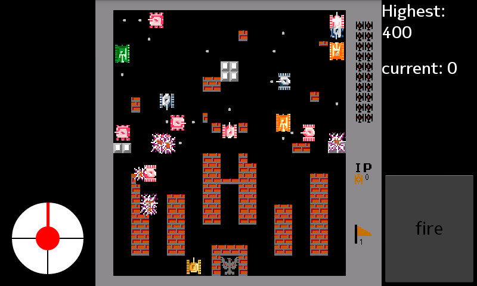
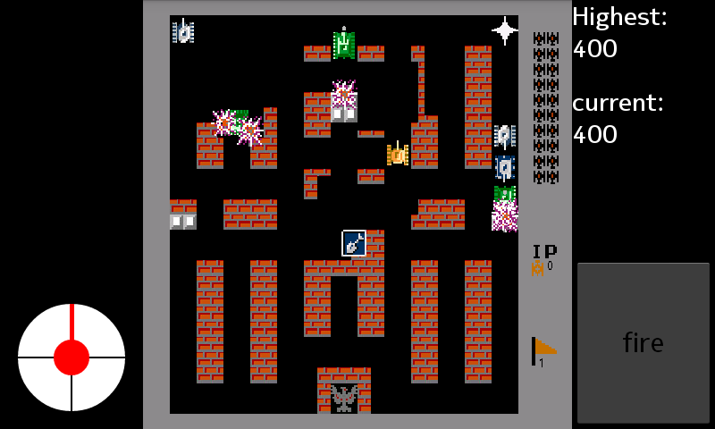

It is a simple game "Endless Battle City"

As a practice of android programming, I use only native android library, without any framework like libgdx.
But if you want to some 'real' game, these framework will save a lot of your time.

Enjoy and have fun.

